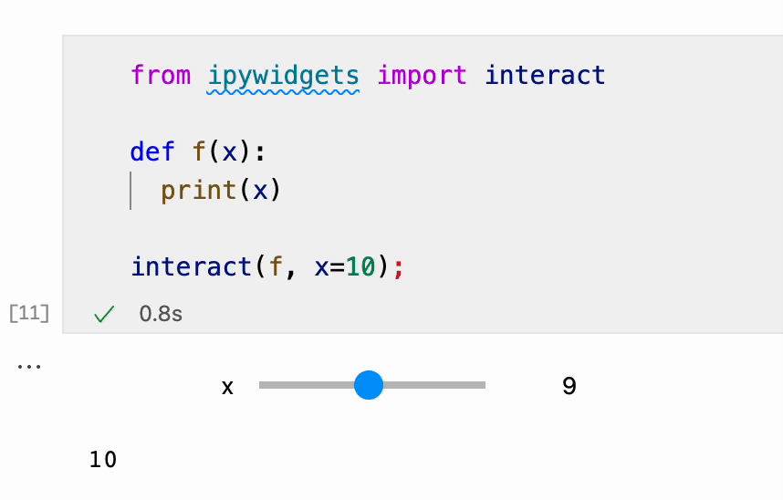

# Demo: Jupyter widget is not working in VSCode

This is a demo that demonstrates a bug with widgets in Jupyter notebook in VSCode running on Apple Silicon Macbook Pro.


## Clone the repository

```
git clone https://github.com/evgenyneu/ipywidgets_vscode_bug.git
cd ipywidgets_vscode_bug
```

## Install

### Install Python 3.9.5 with [ASDF](https://asdf-vm.com)

```
asdf install
```

### Create Python environment

```
python -m venv .venv
```

Activate environment:

```
. .venv/bin/activate
```


### Install Python libraries

```
pip install -r requirements.txt
```


## How to reproduce the bug


* Run `jupyter-lab` and open [widget.ipynb](widget.ipynb).

* Move the slider, the number is printed out and it is changing as you move the slider.

* Now click on `windet.ipynb` in VSCode and run the notebook there.

* As you move the slider, the number is only printed out once and is not changing.




## Hardware/Software versions

* Hardware: MacBook Pro (14-inch, 2021) witjh Apple M1 Pro chip.

* OS: MacOS Monterey 12.0.1.

Note, the bug is not reproduced on Intel Mac runing macOS Catalina.


### VSCode extensions:

* [Python](https://marketplace.visualstudio.com/items?itemName=ms-python.python): v2021.11.1422169775

* [Jupyter](https://marketplace.visualstudio.com/items?itemName=ms-toolsai.jupyter) VSCode extension: v2021.10.1101450599
